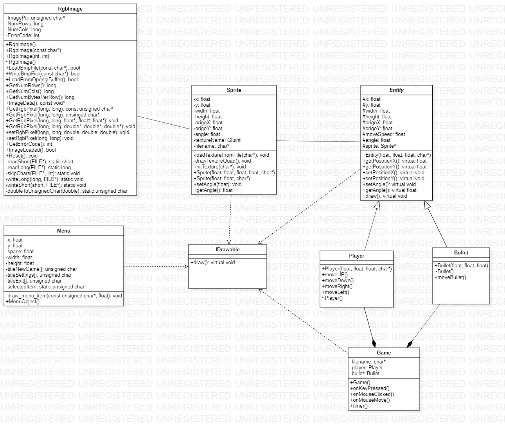

# 2D-Top-down-shooter
*University project in Software Managment, made with C++ and OpenGL.*

### About the project
The goal of our project was to get familiar with the basics of game development. We choosed OpenGL & C++ for our programming language because of the cross-platform API and because of the great documentation. We tried to choose a simple game for our project so we can implement it in time, so that's how we decided to make a 2D top-down shooter because it's easy to implement.

### Class diagram

## License
Licensed under the [GPL-3.0](LICENSE)
