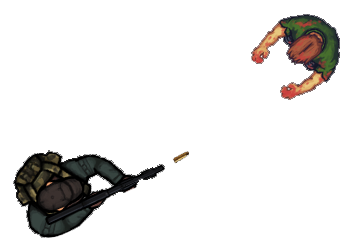
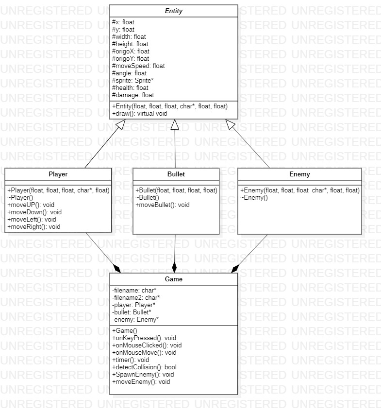

 
  
  
  

 
# 2D-Top-down-shooter
*University project in Software Managment, made with C++ and OpenGL.*
 

### About the project
The goal of our project was to get familiar with the basics of game development. We choosed OpenGL & C++ for our programming language because of the cross-platform API and because of the great documentation. We tried to choose a simple game for our project so we can implement it in time, so that's how we decided to make a 2D top-down shooter because it's easy to implement.

### Class diagram

## Our team :smile:
<table>
  <tr>
    <td align="center"><a href="https://github.com/HbotondS"> <b>Botond Hegyi</b></a> </td>
    <td align="center"><a href="https://github.com/feketeszili"> <b>Szilárd Fekete</b></a> </td>
    <td align="center"><a href="https://github.com/kati1989"> <b>Katalin Kovács</b></a> </td>
  </tr>
</table>

### Our mentor and teacher
<table>
  <tr>
    <td align="center"><a href="https://zszanto.github.io/"> <b>Zoltán Szántó</b></a></td>
  </tr>
</table>

## License
Licensed under the [GPL-3.0](LICENSE)
